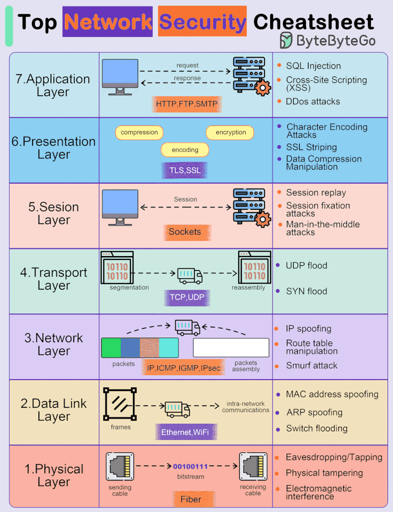

Systems security
===

| Principles \ Scenarios  |  Syscall | BKC/smart contracts | AI agent |
| --- | --- | --- | --- | 
| Confused deputy | | [SEC'23](https://www.usenix.org/system/files/usenixsecurity23-gritti.pdf) | [link](https://arxiv.org/pdf/2408.04870) |
| Buffer overflow | | | |
| Race conditions | TOCTOU | Reentrancy | |

Network security stack
===

Cite: Picture found online.
