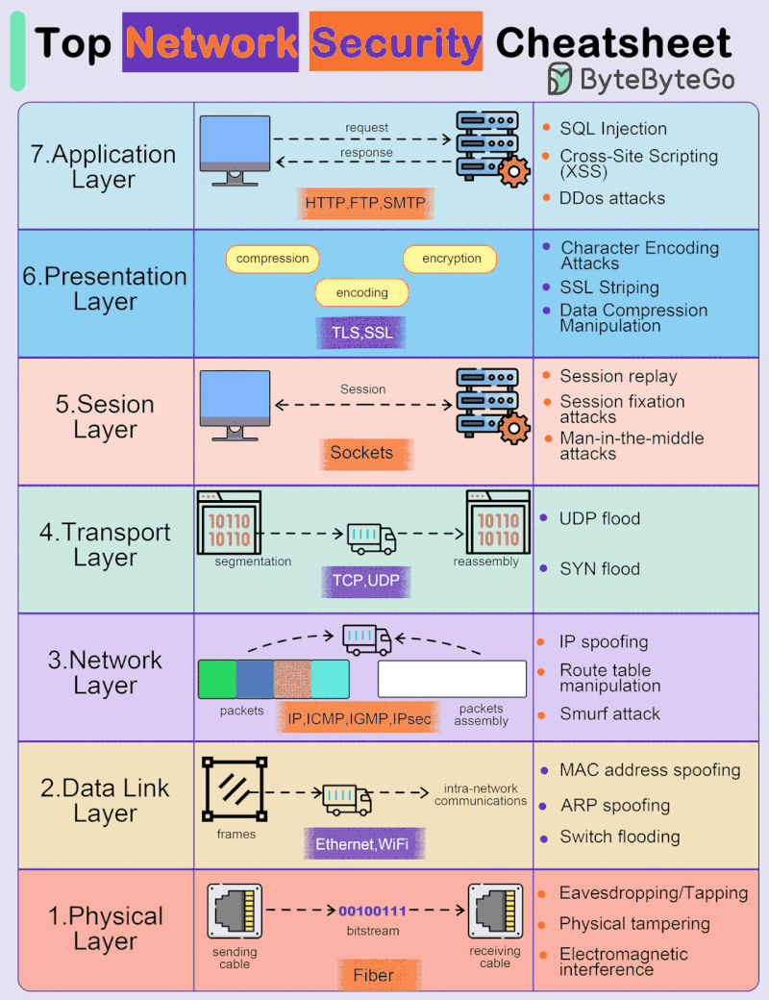

Systems security
===

| Principles \ Scenarios  |  Syscall | BKC/smart contracts | Emerging? |
| --- | --- | --- | --- | 
| Race conditions | TOCTOU | Reentrancy | |
| Confused deputy | | | |
| Buffer overflow | | | |

Network security stack
===

Cite: Picture found online.
